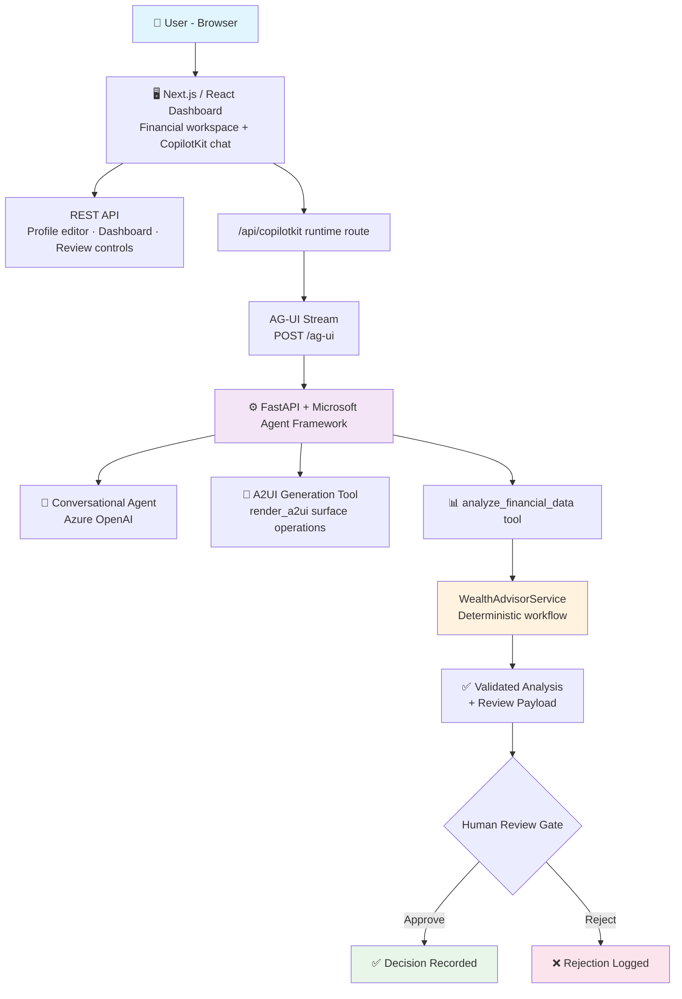

<div align="center">

# 💼 Wealth Advisor Assistant

### Multi-Agent · AG-UI Streaming · A2UI Catalog · Human-in-the-Loop

[](https://python.org)
[](https://fastapi.tiangolo.com/)
[](https://nextjs.org/)
[](https://copilotkit.ai/)
[](https://azure.microsoft.com/en-us/products/ai-services/openai-service)
[](https://learn.microsoft.com/en-us/azure/ai-services/)
[](LICENSE)

<br/>

> **An AI-powered wealth advisory workspace combining a deterministic financial analysis workflow**  
> **with a conversational assistant, portfolio insights, and human-in-the-loop review.**

<br/>

[🚀 Quick Start](#-quick-start) · [🏗️ Architecture](#️-architecture) · [🤖 Agent System](#-agent-system) · [🎨 A2UI Catalog](#-a2ui-catalog) · [⚙️ Configuration](#️-configuration) · [🔧 Troubleshooting](#-troubleshoot--debug)

</div>

---

> **Project status:** The REST analysis and human-review workflow have been exercised locally. The AG-UI backend endpoint is enabled and has produced A2UI tool-call operations in a direct streaming test. End-to-end rendering of those surfaces in the CopilotKit browser chat still needs verification in the local environment.

---

## ✨ Features

| Feature | Description |
|---------|-------------|
| 📊 **Financial Profile Workspace** | Load sample profile, edit JSON, or import a `.json` file |
| 📈 **Financial Overview** | Metric cards — monthly income, expenses, net cash flow, cash buffer, portfolio value |
| 📉 **Cash-Flow Visualization** | Compare monthly income vs spending from supplied history |
| ⚠️ **Risk & Insight Views** | Surface anomalies, risk level, data-quality warnings, evidence-linked discussion points |
| 👤 **Human-in-the-Loop Review** | Approve or reject recommendations via dashboard controls — never executes trades |
| 💬 **Conversational Assistant** | Ask questions about the client profile via CopilotKit + AG-UI |
| 🧩 **A2UI Component Catalog** | Custom read-only components — metric grids, insight lists, charts, tables, timelines |
| ☁️ **Azure OpenAI** | AG-UI streaming path configured for `RUN_MODE=azure_openai` |

---

## 🏗️ Architecture



### System Layout

```
Browser
  └── Next.js / React Dashboard
      ├── Financial profile editor + dashboard
      ├── CopilotKit chat (AG-UI)
      ├── Custom A2UI catalog + renderers
      └── /api/copilotkit runtime route
             │
             ▼
       AG-UI Stream → POST /ag-ui
             │
             ▼
       FastAPI + Microsoft Agent Framework
          ├── Conversational agent (Azure OpenAI)
          ├── A2UI generation tool / surface ops
          └── analyze_financial_data tool
                    │
                    ▼
           WealthAdvisorService (deterministic)
                    │
                    ▼
        Validated analysis + review payload
```

> The **REST analysis flow** is the canonical application interface. The **AG-UI endpoint** provides a separate streaming interface for the conversational experience and exposes analysis results as shared agent state.

---

## 🚀 Quick Start

### Prerequisites

```yaml
Python:    version compatible with requirements.txt
Node.js:   version pinned by the frontend project
Azure:     OpenAI deployment + endpoint + API credentials
```

### 1 · Clone

```powershell
git clone <YOUR_GITHUB_REPOSITORY_URL>
cd wealthproj
```

### 2 · Create & activate Python environment

```powershell
py -m venv .venv
.\.venv\Scripts\Activate.ps1
python -m pip install --upgrade pip
pip install -r requirements.txt
```

> If PowerShell blocks activation:
> ```powershell
> Set-ExecutionPolicy -Scope Process -ExecutionPolicy RemoteSigned
> .\.venv\Scripts\Activate.ps1
> ```

### 3 · Start the backend

```powershell
uvicorn app.main:app --reload --host 127.0.0.1 --port 8000
```

Verify the health endpoint:

```json
{
  "status": "ok",
  "mode": "azure_openai",
  "crm_mode": "memory",
  "ag_ui_enabled": true
}
```

> Confirm `ag_ui_enabled: true` and that the backend logs report registration of `/ag-ui`.

### 4 · Configure and start the frontend

```powershell
cd frontend
npm install
```

Create `frontend/.env.local`:

```dotenv
AGENT_URL=http://127.0.0.1:8000/ag-ui
```

Then:

```powershell
npm run typecheck
npm run build
npm run dev
```

Open the local URL printed by Next.js (`http://localhost:3000` or next available port).

---

## ⚙️ Configuration

### Backend `.env`

```dotenv
RUN_MODE=azure_openai
AZURE_OPENAI_DEPLOYMENT=<your-deployment-name>
AZURE_OPENAI_API_KEY=<your-api-key>
AZURE_OPENAI_ENDPOINT=https://<your-resource-name>.openai.azure.com/
AZURE_OPENAI_API_VERSION=<your-supported-api-version>

# Optional — custom base URL
# AZURE_OPENAI_BASE_URL=<your-base-url>
```

> ⚠️ **Security:** Never commit `.env`, `.env.local`, API keys, access tokens, client data, or financial profiles containing private information. If a real key was ever shared in chat or a public repository, revoke/rotate it immediately.

---

## 🧩 A2UI Catalog

Custom read-only components defined in `frontend/src/lib/a2ui-catalog.tsx`:

| Component | Description |
|-----------|-------------|
| `WealthMetric` / `WealthMetricGrid` | KPI cards — income, expenses, portfolio value |
| `WealthInsightList` | Anomalies, risk flags, evidence-linked insights |
| `WealthComparisonBars` | Side-by-side income vs spending bars |
| `WealthBreakdown` | Allocation breakdown by category |
| `WealthTrendLine` / `WealthMultiSeriesTrend` | Single and multi-series trend lines |
| `WealthDataTable` | Tabular financial data |
| `WealthProgressList` | Goal progress indicators |
| `WealthTimeline` | Event timeline |
| `WealthCallout` | Highlighted alerts and callouts |

> Catalog ID: `wealth-advisor-catalog` — must match exactly on both frontend and backend.

---

## 🖥️ Using the Workspace

```
1.  Load the sample financial profile or import your own JSON
2.  Review displayed currency and profile fields
3.  Click Analyze profile → runs the deterministic workflow
4.  Review analysis summary, metrics, anomalies, and recommendations
5.  When workflow returns pending_review → use dashboard controls to approve or reject
6.  Ask the chat questions about the loaded profile
7.  Request a visualization — metric grid, chart, comparison, table, goal progress, or timeline
```

> ⚠️ Financial outputs are **decision support only** — not personalized investment instructions. Verify figures before any client-facing action. Use only data you are authorized to process.

---

## 🔧 Troubleshoot & Debug

### Verify backend health

```bash
curl http://127.0.0.1:8000/health
```

Confirm `ag_ui_enabled: true`.

### Test the AG-UI stream directly

```powershell
$body = '{"messages":[{"role":"user","content":"Create a simple A2UI surface with a metric card labeled Connectivity Test and value 1. Call the render_a2ui tool instead of describing the card in text."}]}'

curl.exe -N -i http://127.0.0.1:8000/ag-ui `
  -H "Content-Type: application/json" `
  -H "Accept: text/event-stream" `
  --data-binary $body
```

> Confirms backend `generate_a2ui` + `render_a2ui` calls — but not frontend rendering (bypasses CopilotKit runtime).

### If chat displays only text

| Check | What to look for |
|-------|-----------------|
| Browser DevTools → Network | Inspect `/api/copilotkit/agent/wealthAdvisor/run` for A2UI events |
| Python logs | Look for `render_a2ui` calls |
| `route.ts` | Confirm it routes `wealthAdvisor` → `AGENT_URL` with A2UI processing |
| `providers.tsx` | Confirm CopilotKit v2 provider + `wealthAdvisorCatalog` passed to A2UI config |
| Catalog ID | Must be exactly `wealth-advisor-catalog` on both sides |
| Package versions | Run `npm ls @copilotkit/react-core @copilotkit/runtime @copilotkit/a2ui-renderer @ag-ui/client` |
| After changes | Run `npm run typecheck && npm run build` |

### Fallback if A2UI event rendering remains incompatible

A typed visualization tool that returns a validated display model (`metric_grid`, `comparison_bars`, `line_chart`, `data_table`) with a React renderer mapping those types to existing components. Preserves the conversational agent and deterministic financial service — avoids dependence on A2UI event translation. All numeric values must be validated against the current profile or analysis result.

---

## 📡 API Endpoints

| Method | Endpoint | Description |
|:------:|----------|-------------|
| `GET` | `/health` | Local application health + configuration status |
| `POST` | `/ag-ui` | AG-UI streaming endpoint — used by CopilotKit runtime |
| `POST` | `/api/wealth/analyze` | Start financial analysis workflow |
| `POST` | `/api/wealth/runs/{run_id}/review` | Submit human-review decision (approve / reject) |

> `/api/wealth/...` paths may be Next.js proxy routes rather than direct FastAPI endpoints.

---

## 📂 Project Structure

```
wealthproj/
│
├── 📁 app/
│   ├── agui_integration.py       # AG-UI / A2UI bridge + agent setup
│   ├── config.py                 # Backend settings + env vars
│   ├── 📁 models/                # Validated domain models
│   └── 📁 services/              # Wealth advisor workflow + service logic
│
├── 📁 frontend/
│   ├── 📁 src/app/               # Next.js app, API routes, providers
│   └── 📁 src/lib/
│       ├── a2ui-catalog.tsx      # Custom A2UI component definitions + renderers
│       └── sample-financial-data.*
│
├── requirements.txt
└── README.md
```

---

## 🎨 Development Principles

| Principle | Detail |
|-----------|--------|
| **Deterministic first** | Keep calculations and validation in the backend workflow |
| **Source of truth** | Supplied client profile + workflow result — never LLM-invented figures |
| **Currency integrity** | Preserve currency codes — never combine without an explicit exchange rate |
| **Read-only A2UI** | Components are display-only — approval/rejection stays in the review workflow |
| **No secrets in code** | Never commit credentials, real client data, or private financial profiles |

---

## 🧱 Tech Stack

| Layer | Technology |
|-------|------------|
| Frontend | [Next.js](https://nextjs.org/) + React + TypeScript |
| Chat UI | [CopilotKit v2](https://copilotkit.ai/) + AG-UI client |
| A2UI | Custom catalog — `wealth-advisor-catalog` |
| Backend | [FastAPI](https://fastapi.tiangolo.com/) + Python |
| Agent Orchestration | Microsoft Agent Framework |
| Streaming | AG-UI adapter — `/ag-ui` endpoint |
| LLM | [Azure OpenAI](https://azure.microsoft.com/en-us/products/ai-services/openai-service) |
| Financial Analysis | WealthAdvisorService — deterministic domain workflow |

---

<div align="center">

Built with ❤️ by **Alen Thomas**

[](https://github.com/AIstar007)
[](https://www.linkedin.com/in/alen-thomas-3558bb187)
[](https://portfolio-website-alpha-nine-69.vercel.app/)

</div>
