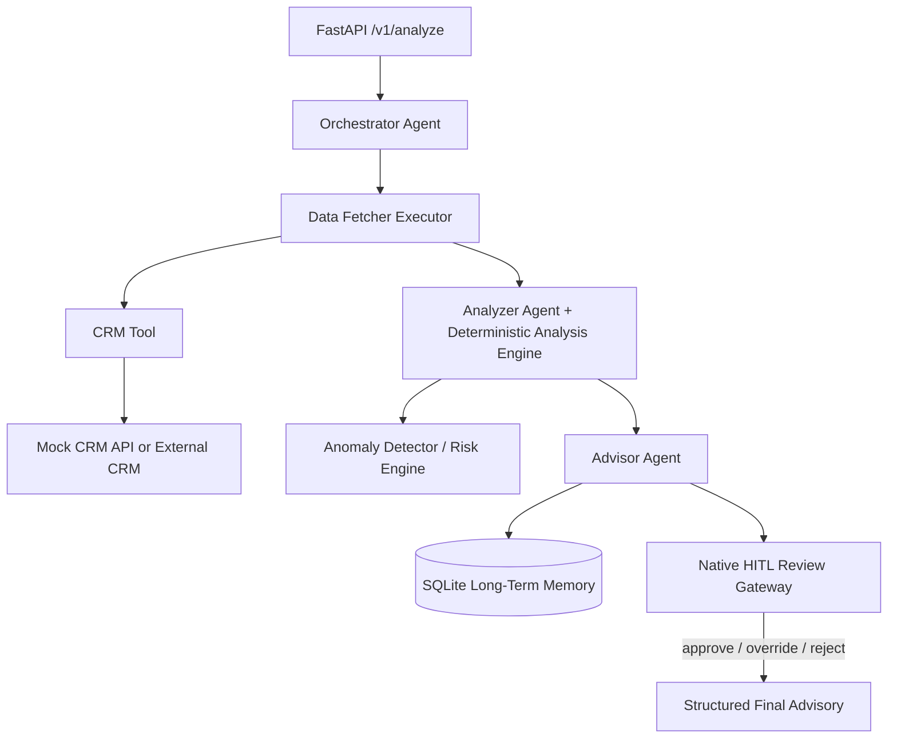

# Architecture

## Component view

## Why this split?

The LLM-backed agents perform coordination, interpretation and recommendation drafting. Financial metrics and anomaly decisions are deterministic Python functions so they are reproducible, testable and auditable.

## Agent responsibilities

### OrchestratorAgent
Produces a small structured execution plan. The workflow runtime, rather than the model, owns the actual control flow. This prevents an LLM from bypassing required stages.

### Data Fetcher
Uses the `CRMTool` abstraction. A caller can switch between `InMemoryCRMTool` and `HTTPCRMTool` without changing the workflow or agents.

### AnalyzerAgent
Receives authoritative deterministic results and converts them into an evidence-based executive narrative.

### AdvisorAgent
Combines deterministic analysis, CRM context and historical memory into structured advisor decision support.

### ReviewGateway
Pauses with Agent Framework `request_info` for HIGH/CRITICAL outputs. The workflow can resume from the response and its executor state can be checkpointed.

## Failure strategy

1. Pydantic rejects malformed client data before processing.
2. CRM failures are retried and then downgraded to partial context.
3. Deterministic analysis continues using the client-provided data.
4. Agent structured-output failures fail the workflow rather than silently mutating financial facts.
5. Memory persistence failure is logged but does not destroy an otherwise valid advisory result.
6. HIGH/CRITICAL risk triggers a human checkpoint.
